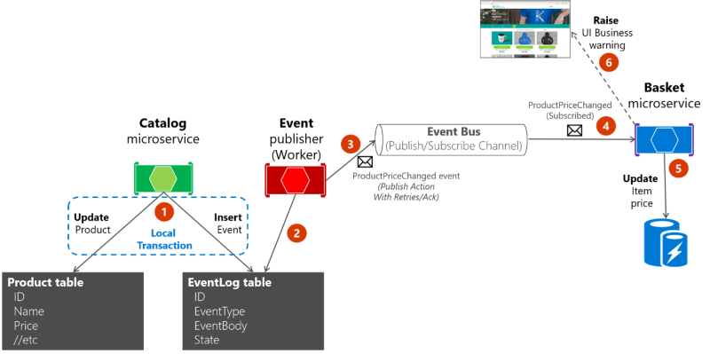
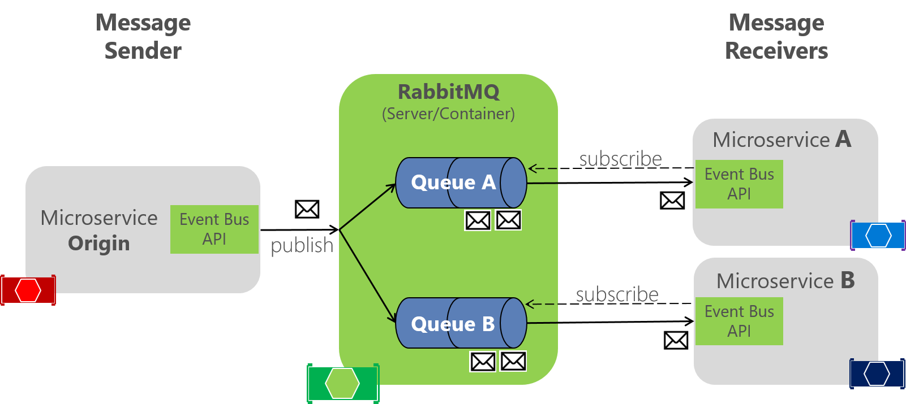

[`🏠 HOME`](../../README.md)  

[`📘 THEORY`](../README.md) 


[Навчальний посібник з RabbitMQ](./RabbitMQ_tutorials.md)

# RabbitMQ

**RabbitMQ** — це брокер повідомлень із відкритим вихідним кодом, який реалізує протокол черги повідомлень, здатний обмінюватися повідомленнями між видавцями та слухачами між різними каналами та маршрутами.

Серед основних функцій RabbitMQ знайдіть деякі важливі нижче з коротким поясненням

**Message**: повідомлення є ключовою частиною спілкування RabbitMQ. 
Він рухається по каналах, від видавця до слухачів, і може мати будь-яку інформацію, від простого тексту до складних об’єктів, серіалізованих.

**Channel**: канал — це логічна лінія зв’язку між видавцем і слухачами. Він стоїть на існуючому з'єднанні та може передавати повідомлення через різні протоколи.

**Queue**: Черга RabbitMQ працює за шаблоном FIFO для зберігання повідомлень між видавцями та слухачами.

**Connection**: з’єднання RabbitMQ базується на протоколах, є основою для роботи каналів і, як сказано в його назві, з’єднує сервер із клієнтом.

**Consumer**: клієнт RabbitMQ, підключений до каналу, який прослуховує його черги, щоб читати опубліковані на ньому повідомлення.

**Publisher**: клієнт RabbitMQ, підключений до черги публікації повідомлень.

**Notification**: сповіщення пов’язані з моніторингом працездатності служби та можуть бути налаштовані для попередження на основі показників.

**Dead letter**: у RabbitMQ мертві листи використовуються для зберігання повідомлень, які не змогли прочитати їх слухачі. Його можна не прочитати через те, що повідомлення було відхилено слухачами, або тому, що черга була заповнена, або через час закінчення терміну дії повідомлення.

**Route**: маршрути RabbitMQ відповідають за надсилання повідомлень у правильні черги на основі їхніх ключів маршрутизації та обмінів.

**Virtual Host**: у порівнянні з базою даних SQL Server, віртуальний хост RabbitMQ буде базою даних SQL Server. Віртуальні хости мають власні налаштування та не залежать від інших віртуальних хостів, вони мають власні канали, прив’язки, протоколи, користувачів тощо.

**Exchange**: обмін RabbitMQ відповідає за маршрутизацію повідомлень до своїх черг на основі їх атрибутів.

**Bindings**: прив’язка RabbitMQ працює як посилання з черги на біржу.

## Основні переваги використання RabbitMQ:

- Мультиплатформенний зв’язок із серіалізацією/десеріалізацією повідомлень на поширених мовах, таких як JSON;  
- Асинхронні операції, не залишаючи служби заблокованими в очікуванні відповіді;  
- З відкритим вихідним кодом, велика спільнота щодня працює над покращенням його функцій;  
- Багатомовність із широким діапазоном прийнятних мов;  
- Мультипротокольний, з різними типами протоколів, що використовуються для обміну повідомленнями.  

Завантажити:

RabbitMQ Server and Erland(required for RabbitMQ)  
https://www.rabbitmq.com/download.html  
RabbitMQ client for .Net  
https://www.rabbitmq.com/dotnet.html   
https://www.nuget.org/packages/RabbitMQ.Client/   

Дефолтна RabbitMQ конфiгурацiя:

***Endpoint address***: http://localhost:15672/  
***Login***: guest  
***Password***: guest   
***Windows Service Name***: RabbitMQ  
Windows menu item to start the service: RabbitMQ Service - start  

Старт:  

1.   
```powershell
docker run -it --rm --name rabbitmq -p 5672:5672 -p 15672:15672 rabbitmq:3.13-management
```

2.  
> http://localhost:15672/#/

3.  
> login: guest  
> password: guest  


  
[CAP and events](./_RESOURCES/IMAGES/cap_and_events.png)  

  
[RabbitMQ implementation](./_RESOURCES/IMAGES/rabbitmq_implementation.png)  

  
[Schema](./_RESOURCES/IMAGES/schema.png)  


# Когда и зачем нужен RabbitMQ

В сложных системах, системах с вычислительными задачами, а также требующих гарантированной доставки важно организовать распределённую архитектуру и наладить коммуникацию между компонентами. Для решения задач с подобными вводными требованиями выбирают RabbitMQ — брокер сообщений с открытым исходным кодом. В статье рассмотрим основные сценарии его использования и разберём, когда и зачем нужен RabbitMQ. 

***Брокер сообщений как показатель зрелости системы***

Если вы возьмёте любой сервис, почти наверняка в нём будет брокер сообщений. Это не обязательное условие, но оно считается одним из показателей зрелости системы. По мере развития сервиса и усложнения бизнес-функционала потребность в брокере сообщения только возрастает. Поэтому чем раньше вы начнёте его использовать, тем меньше костылей и технического долга появится в вашем проекте. 

***Какие проблемы решает брокер сообщения?*** Представим, что в ваш сервис пришёл новый пользователь и хочет зарегистрироваться. При регистрации он указывает адрес электронной почты, и для его валидации вам нужно послать уведомление с кодом. Чтобы реализовать отправку сообщения, нужно интегрироваться с внешней системой. Но вы не хотите, чтобы пользователь ждал ответа удалённой системы. Вместо этого вы хотите, чтобы его сразу перенаправили на следующую страницу, где будет запрашиваться ввод кода с надписью «Подтвердить электронную почту». Брокер сообщений позволяет выполнять описанные операции асинхронно. 

Асинхронный подход решает множество задач. Вместо того, чтобы планировать архитектуру, где каждый компонент посылает запросы к другим компонентам и ожидает от них ответа, вы просто отправляете сообщение в брокер. А один или несколько сервисов получают это сообщение и обрабатывают его в удобное время, что позволяет не блокировать программы. Если же у вас одни сервисы синхронно ждут другие, вы очень быстро упираетесь в ограничение по ресурсам, когда скорость всей системы равна скорости её самого медленного компонента.

Также использование брокера сообщений позволяет вашим сервисам ничего не знать о том, кто их обрабатывает. За счёт этого разные компоненты могут оставаться полностью изолированными и самостоятельными — достаточно только подписаться на нужную очередь. 

Брокеры сообщений — посредники между сервисами. Они находятся в центре архитектуры и управляют потоками информации. Благодаря этому каждый сервис может послать сообщение другому сервису или целой группе сервисов. Такой подход стал популярен с развитием микросервисов и заставил пересмотреть отношение к отказоустойчивости.

## Зачем использовать брокеры сообщений

Если сломается брокер, в худшем случае вы потеряете часть сообщений, но ядро сервиса всё ещё будет работать, так как берет информацию из базы данных. Сообщения будут накапливаться, и когда сервер вернётся, то быстро прочитает и обработает образовавшийся долг. Но иногда возникает частичная деградация: какая-то информация может оказаться не самой актуальной, хотя пользователи, скорее всего, этого даже не заметят. Пример — новостная лента в соцсетях. Если она не будет обновляться некоторое время, вы все равно сможете посмотреть опубликованные посты. 

Бывает, что сервисы, спроектированные и написанные в краткие сроки, не имеют брокера сообщений. Потребность реализовать этот функционал осознаётся значительно позже. И здесь есть два варианта. Первый — сэкономить и в качестве брокера сообщений использовать базу данных. Это не очень хорошо, потому что решает проблему только на раннем этапе.

Второй вариант — настроить брокер сообщений. Так вы сможете обеспечить своему приложению технологический запас для будущего развития. Одним из наиболее популярных брокеров сообщений остаётся RabbitMQ.

## Что такое RabbitMQ

**RabbitMQ** — распределённый и горизонтально масштабируемый брокер сообщений. Упрощённо его устройство можно описать так:

- паблишер, который отправляет сообщения;  
- очередь, где хранятся сообщения;  
- подписчики, которые выступают получателями сообщений.

RabbitMQ передаёт сообщения между поставщиками и подписчиками через очереди. Сообщения могут содержать любую информацию, например, о событии, произошедшем на сайте. 

RabbitMQ отлично подходит для интеграции разных компонентов, создания микросервисов, потоковой передачи данных в режиме реального времени или при передаче работы удалённым работникам. Его используют крупные компании, в числе которых Bloomberg, Reddit, WeWork, NASA и др. 

## Почему выбирают RabbitMQ:

- RabbitMQ поддерживает несколько протоколов: AMQP, MQTT, STOMP и др., что позволяет использовать его в разных сценариях.

- RabbitMQ хранит сообщение до тех пор, пока принимающее приложение не подключится и не получит его из очереди. Клиент может подтвердить получение сообщения сразу или после того, как полностью обработает его. Как только такое подтверждение получено, сообщение удаляется из очереди. Для сравнения в Kafka очередь сообщений является постоянной — данные хранятся, пока не истечёт указанный период или не будет достигнуто ограничение по размеру. Поэтому важно убедиться, что событие, которое должно произойти один раз, не воспроизводится многократно. 

- Основное преимущество RabbitMQ — гибкая маршрутизация. Сообщения маршрутизируются через exchange (обменник) перед попаданием в очереди. RabbitMQ предлагает несколько встроенных типов обмена для типичной логики маршрутизации. 

- RabbitMQ поддерживает приоритезацию в очередях и позволяет настроить диапазон приоритетов. Приоритет каждого сообщения устанавливается при его публикации. 

- RabbitMQ предлагает простой пользовательский интерфейс управления. Он позволяет контролировать каждый аспект брокера сообщений.

## Сценарии использования RabbitMQ

Обычно отмечают два варианта, когда стоит использовать RabbitMQ: для фоновой обработки данных и для интеграции внутри приложений и между ними, т.е. в качестве брокера сообщений между микросервисами. Рассмотрим оба сценария. 

### Фоновая обработка данных

Фоновая обработка данных — оптимальный сценарий использования RabbitMQ. Вы можете поместить сообщение в очередь без его немедленной обработки.

Пример: вы хотите загрузить отчёт из приложения. Приложение обрабатывает информацию и генерирует PDF-файл в течение 15-20 минут. Затем отправляет его вам по электронной почте. Очередь сообщений позволяет выполнить все задачи асинхронно.

Очереди RabbitMQ служат шинами событий и позволяют веб-серверам быстро реагировать на запросы вместо того, чтобы выполнять трудоемкие задачи на месте.

### Посредник в микросервисной архитектуре

Также RabbitMQ часто используется для микросервисной архитектуры, где он выступает средством связи между приложениями и помогает избегать узких мест при передаче сообщений.

### Ещё пара слов о RabbitMQ напоследок

Когда приложение ломается, другие приложения уже не могут обмениваться с ним сообщениями, поэтому работа останавливается. RabbitMQ же кладёт сообщение в очередь, дожидается, пока сломанное приложение починят, и отдаёт ему сообщение из очереди. Да, есть некоторая задержка на время устранения причины поломки, но глобально ничего не падает. 

Также RabbitMQ выполняет распределённые нагрузки. Несколько копий одного приложения могут быть запущены на разных компьютерах. RabbitMQ распределит нагрузку относительно производительности и выберет, кому отправить сообщение. 

RabbitMQ — больше, чем просто брокер сообщений. Он основан на ERLANG и платформе Open Telecom, обеспечивающей высокую производительность при использовании минимальных ресурсов. Его выбирают, когда требуется надёжная доставка сообщений и гибкая маршрутизация. 