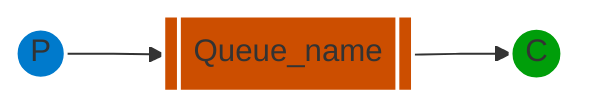
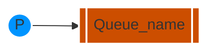
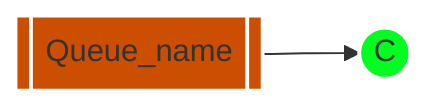
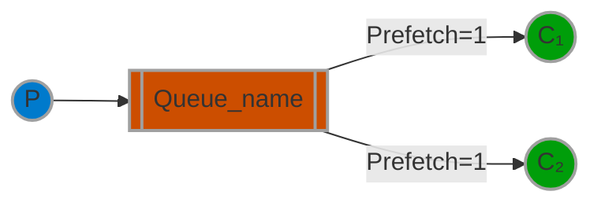
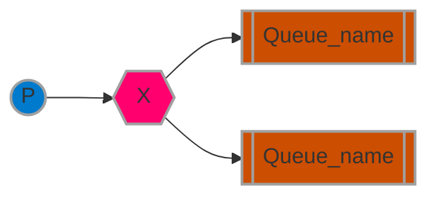

```mermaid
flowchart LR;
    C((C))

    style C fill:#00FF21, stroke:#FFFFFF,stroke-width:2px

    C
```

[`🏠 HOME`](../../README.md)  

[`📘 RabbitMQ THEORY`](./README.md) 

# Навчальний посібник з RabbitMQ - "Hello World!"

## Вступ

> [!NOTE]  
> **Попередні вимоги**  
>
> Цей навчальний посібник передбачає, що RabbitMQ встановлено і працює на `localhost` за стандартним портом (5672). У разі використання іншого хосту, порту або облікових даних, потрібно буде налаштувати параметри підключення.

RabbitMQ - це посередник повідомлень: він приймає та пересилає повідомлення. Ви можете уявити його як поштове відділення: коли ви кладете лист у поштову скриньку, ви можете бути впевнені, що поштар рано чи пізно доставить листа вашому одержувачеві. У цій аналогії RabbitMQ - це поштова скринька, поштове відділення та поштар.

Основна різниця між RabbitMQ та поштовим відділенням полягає в тому, що RabbitMQ не працює з паперовими документами, замість цього він приймає, зберігає та пересилає бінарні блоби даних - *повідомлення*.

RabbitMQ, так само як і взагалі відправка повідомлень, використовує певний жаргон.

• ***Продукування*** (Producing) означає не що інше, як відправлення. Програма, яка відправляє повідомлення, - це ***продюсер***.


• ***Черга*** - це назва для поштової скриньки в RabbitMQ. Хоча повідомлення проходять через RabbitMQ та ваші програми, вони можуть бути збережені лише всередині ***черги***. ***Черга*** обмежується лише обсягами пам'яті та диска хоста, і, по суті, це великий буфер для повідомлень.

Багато ***продюсерів*** можуть відправляти повідомлення, які йдуть в одну чергу, і багато ***споживачів*** можуть намагатися отримати дані з однієї черги.

Ось як ми представляємо чергу:


• ***Споживання*** має схоже значення з отриманням. ***Споживач*** - це програма, яка в основному очікує на отримання повідомлень.



Зверніть увагу, що виробник, споживач і посередник не обов'язково повинні знаходитися на одному хості; насправді, в більшості програм вони цього не роблять. А додаток може бути обома як продюсером так і споживачем.

## "Hello World"

У цій частині посібника ми напишемо дві програми на C#: продюсера, який відправляє одне повідомлення, і споживача, який отримує повідомлення і виводить їх. Ми обійдемо деякі деталі у .NET-клієнтському API, зосереджуючись на цій дуже простій речі, щоб приступити до роботи. Це "Hello World" у світі повідомлень.

На діаграмі нижче "P" - це наш продюсер, а "C" - наш споживач. Квадрат у середині - це черга - буфер повідомлень, який RabbitMQ зберігає від імені споживача.



> **The .NET client library**
>
> RabbitMQ підтримує кілька протоколів. У цьому навчальному посібнику використовується AMQP 0-9-1, який є відкритим, загального призначення протоколом для обміну повідомленнями. Існує кілька клієнтів для RabbitMQ на багатьох різних мовах програмування. Ми використовуватимемо .NET-клієнт, який надається RabbitMQ.
>
> Цей клієнт підтримує .NET Core, а також .NET Framework 4.5.1+. У цьому навчальному посібнику буде використано RabbitMQ .NET-клієнт версії 5.0 та .NET Core, тому переконайтеся, що ви його встановили і вказали в свій шлях.
> 
> Ви також можете використовувати .NET Framework для виконання цього навчального посібника, однак кроки налаштування будуть іншими.
>
> RabbitMQ .NET-клієнт версії 5.0 та пізніших версій розповсюджується через NuGet.
> 
> Цей навчальний посібник передбачає, що ви використовуєте PowerShell на Windows. На MacOS та Linux підходить практично будь-яка оболонка.

## Налаштування

Спочатку переконайтеся, що у вас є інструментальний набір .NET Core у вашому `PATH`.

```powershell
dotnet --help
```

Додайте команду, щоб вона вивела довідкове повідомлення.

Тепер згенеруйте два проекти: один для виробника та один для споживача.

```powershell
dotnet new console --name Send
mv Send/Program.cs Send/Send.cs
dotnet new console --name Receive
mv Receive/Program.cs Receive/Receive.cs
```

Це створить дві нові теки з назвами `Send` та `Receive`.

Потім ми додаємо залежність від клієнта.

```powershell
cd Send
dotnet add package RabbitMQ.Client
cd ../Receive
dotnet add package RabbitMQ.Client
```

Тепер, коли у нас налаштований проект .NET, ми можемо написати деякий код.

## Надсилання



Ми називаємо наш відправник повідомлень (виробник) `Send.cs`, а отримувач повідомлень (споживач) `Receive.cs`. Відправник буде підключатися до RabbitMQ, відправляти одне повідомлення, а потім завершувати роботу.

У файлі `Send.cs`(https://github.com/rabbitmq/rabbitmq-tutorials/blob/main/dotnet/Send/Send.cs) нам потрібно використовувати деякі простори імен:

```cs
using System.Text;
using RabbitMQ.Client;
```

Потім ми можемо створити з'єднання з сервером:

```cs
var factory = new ConnectionFactory { HostName = "localhost" };
using var connection = factory.CreateConnection();
using var channel = connection.CreateModel();
...
```

З'єднання абстрагує з'єднання сокетів та відповідає за переговори щодо версії протоколу, аутентифікацію тощо за нас. Тут ми підключаємось до вузла RabbitMQ на локальному комп'ютері - тобто localhost. Якщо ми хочемо підключитись до вузла на іншому комп'ютері, просто вкажемо його ім'я хоста або IP-адресу тут.

Далі ми створюємо канал, де знаходиться більшість API для виконання завдань.

Щоб відправити повідомлення, нам потрібно оголосити чергу, до якої ми хочемо відправити повідомлення; після цього ми можемо опублікувати повідомлення у чергу:

```cs
using System.Text;
using RabbitMQ.Client;

var factory = new ConnectionFactory { HostName = "localhost" };
using var connection = factory.CreateConnection();
using var channel = connection.CreateModel();

channel.QueueDeclare(queue: "hello",
                     durable: false,
                     exclusive: false,
                     autoDelete: false,
                     arguments: null);

const string message = "Hello World!";
var body = Encoding.UTF8.GetBytes(message);

channel.BasicPublish(exchange: string.Empty,
                     routingKey: "hello",
                     basicProperties: null,
                     body: body);
Console.WriteLine($" [x] Sent {message}");

Console.WriteLine(" Press [enter] to exit.");
Console.ReadLine();
```

Оголошення черги є ідемпотентним - воно буде створено лише у випадку, якщо вона ще не існує. Вміст повідомлення - це масив байтів, тому ви можете кодувати там все, що завгодно.

Коли код вище завершить своє виконання, канал і з'єднання будуть закриті. Це все стосується нашого відправника.

[Ось весь клас Send.cs](https://github.com/rabbitmq/rabbitmq-tutorials/blob/main/dotnet/Send/Send.cs)

> **Надсилання не працює!**
>
> Якщо це ваш перший раз використання RabbitMQ, і ви не бачите повідомлення "Sent", то ви, можливо, залишились з питанням, що може бути не так. Можливо, брокер був запущений без достатньої вільної місця на диску (за замовчуванням для цього потрібно щонайменше 50 МБ вільного місця) і, отже, відмовляється приймати повідомлення. Перевірте журнал брокера для підтвердження цього і, за необхідності, зменште ліміт. Документація з налаштування покаже вам, як встановити `disk_free_limit`.

## Отримання

Що ж до споживача, він слухає повідомлення від RabbitMQ. Таким чином, на відміну від продюсера, який публікує одне повідомлення, ми будемо тримати споживача постійно працюючим, щоб він слухав повідомлення і виводив їх.



Код (у файлі [Receive.cs](https://github.com/rabbitmq/rabbitmq-tutorials/blob/main/dotnet/Receive/Receive.cs)) має майже ті ж самі блоки коду `using`, що й у `Send`:
```cs
using System.Text;
using RabbitMQ.Client;
using RabbitMQ.Client.Events;
```

Налаштування аналогічне відправнику; ми відкриваємо з'єднання і канал, та оголошуємо чергу, з якої ми будемо споживати. Зауважте, що це відповідає черзі, на яку відправляє повідомлення `Send`.

```cs
var factory = new ConnectionFactory { HostName = "localhost" };
using var connection = factory.CreateConnection();
using var channel = connection.CreateModel();

channel.QueueDeclare(queue: "hello",
                     durable: false,
                     exclusive: false,
                     autoDelete: false,
                     arguments: null);
...
```

Зверніть увагу, що ми також оголошуємо чергу тут. Оскільки ми можемо запустити споживача перед відправником, ми хочемо переконатися, що черга існує, перш ніж ми спробуємо споживати повідомлення з неї.

Ми збираємося повідомити сервер, щоб він доставив нам повідомлення з черги. Оскільки він буде відправляти нам повідомлення асинхронно, ми надаємо зворотний виклик. Це те, що робить обробник подій `EventingBasicConsumer.Received`.

```cs
using System.Text;
using RabbitMQ.Client;
using RabbitMQ.Client.Events;

var factory = new ConnectionFactory { HostName = "localhost" };
using var connection = factory.CreateConnection();
using var channel = connection.CreateModel();

channel.QueueDeclare(queue: "hello",
                     durable: false,
                     exclusive: false,
                     autoDelete: false,
                     arguments: null);

Console.WriteLine(" [*] Waiting for messages.");

var consumer = new EventingBasicConsumer(channel);
consumer.Received += (model, ea) =>
{
    var body = ea.Body.ToArray();
    var message = Encoding.UTF8.GetString(body);
    Console.WriteLine($" [x] Received {message}");
};
channel.BasicConsume(queue: "hello",
                     autoAck: true,
                     consumer: consumer);

Console.WriteLine(" Press [enter] to exit.");
Console.ReadLine();
```

[Ось весь клас Receive.cs](https://github.com/rabbitmq/rabbitmq-tutorials/blob/main/dotnet/Receive/Receive.cs):

## Об'єднаймо все разом.
Відкрийте два термінальні вікна.

Ви можете запускати клієнти у будь-якому порядку, оскільки обидва оголошують чергу. Ми спочатку запустимо споживача, щоб ви могли побачити, як він очікує та отримує повідомлення.
```powershell
cd Receive
dotnet run
```

Далі запустіть продюсера.

```powershell
cd Send
dotnet run
```

Споживач роздрукує повідомлення, яке він отримає від виробника через RabbitMQ. Споживач буде продовжувати працювати, очікуючи повідомлень, тому спробуйте перезапустити виробника кілька разів.

Час перейти до другої частини і побудувати просту робочу чергу.

---

# Навчальний посібник з RabbitMQ - Робочі Черги
## Робочі Черги

> [!NOTE]  
> **Попередні вимоги**  
>
> Цей навчальний посібник передбачає, що RabbitMQ встановлено і працює на `localhost` за стандартним портом (5672). У разі використання іншого хосту, порту або облікових даних, потрібно буде налаштувати параметри підключення.


У першому посібнику ми написали програми для надсилання та отримання повідомлень з іменованої черги. У цьому ми створимо ***Робочу Чергу***, яка буде використовуватися для розподілу часомістких завдань серед кількох робітників.

Основна ідея за Робочими Чергами (також відомими як: Черги Завдань) полягає в уникненні безпосереднього виконання ресурсоємких завдань і очікуванні їх завершення. Замість цього ми плануємо виконання завдання на пізніший час. Ми інкапсулюємо ***завдання*** у вигляді повідомлення та надсилаємо його у чергу. Робочий процес, що працює у фоновому режимі, витягне завдання з черги та в кінцевому підсумку виконає його. Коли ви запускаєте багато робітників, завдання буде розподілено між ними.

Ця концепція особливо корисна в веб-додатках, де неможливо обробити складне завдання протягом короткого вікна HTTP-запиту.

## Підготовка

У попередній частині цього посібника ми надсилали повідомлення зі стрічкою "Hello World!". Тепер ми будемо надсилати рядки, які відображають складні завдання. У нас немає реальних завдань, наприклад, зменшення розміру зображень або рендеринг PDF-файлів, тому давайте вигадаємо, що ми зайняті - використовуючи функцію `Thread.Sleep()` (вам потрібно додати `using System.Threading;` в самому початку файлу, щоб отримати доступ до API-функцій потоків). Ми будемо вважати кількість крапок у рядку його складністю; кожна крапка буде відповідати одній секунді "роботи". Наприклад, вигадане завдання, описане рядком `Hello...`, займе три секунди.

Ми незначно змінимо програму ***Send*** з нашого попереднього прикладу, щоб дозволити відправляти довільні повідомлення з командного рядка. Ця програма буде планувати завдання до нашої робочої черги, тому назвемо її `NewTask`.

Як і в першому посібнику, нам потрібно створити два проекти.

```powershell
dotnet new console --name NewTask
mv NewTask/Program.cs NewTask/NewTask.cs
dotnet new console --name Worker
mv Worker/Program.cs Worker/Worker.cs
cd NewTask
dotnet add package RabbitMQ.Client
cd /docs/Worker
dotnet add package RabbitMQ.Client
```

Скопіюйте код зі старого ***Send.cs*** до ***NewTask.cs*** та внесіть наступні зміни.

Оновіть ініціалізацію змінної ***message***:

```cs
var message = GetMessage(args);
```

Add the ***GetMessage*** method to the end of the ***NewTask*** class:

```cs
static string GetMessage(string[] args)
{
    return ((args.Length > 0) ? string.Join(" ", args) : "Hello World!");
}
```

Нашому старому скрипту ***Receive.cs*** також потрібні деякі зміни, щоб виглядати як одна секунда роботи на кожну крапку в тілі повідомлення. Він буде обробляти повідомлення, доставлені RabbitMQ, та виконувати завдання, тому скопіюйте його до ***Worker.cs*** та внесіть зміни, як описано нижче.

Після нашого існуючого ***WriteLine*** для отримання повідомлення, додайте фіктивне завдання для симуляції часу виконання:

```cs
Console.WriteLine($" [x] Received {message}");

int dots = message.Split('.').Length - 1;
Thread.Sleep(dots * 1000);

Console.WriteLine(" [x] Done");
```

# Диспетчиризація круг по кругу (round-robin) 

Однією з переваг використання Черги Завдань є здатність легко паралелізувати роботу. Якщо у нас накопичується велика кількість роботи, ми можемо просто додати більше робітників і таким чином легко масштабувати систему.

Спочатку давайте спробуємо запустити два екземпляри `Worker` одночасно. Вони обидва отримають повідомлення з черги, але як саме це відбудеться? Давайте подивимося.

Вам потрібно відкрити три консолі. Дві з них будуть запускати програму `Worker`. Ці консолі будуть нашими двома споживачами - C1 та C2.

```powershell
# shell 1
cd Worker
dotnet run
# => Press [enter] to exit.
```

```powershell
# shell 2
cd Worker
dotnet run
# => Press [enter] to exit.
```

У третій консолі ми будемо публікувати нові завдання. Після запуску споживачів ви можете опублікувати кілька повідомлень:

```powershell
# shell 3
cd NewTask
dotnet run "First message."
dotnet run "Second message.."
dotnet run "Third message..."
dotnet run "Fourth message...."
dotnet run "Fifth message....."
```

Перевіримо, що буде доставлено до наших робітників:

```powershell
# shell 1
# => Press [enter] to exit.
# => [x] Received First message.
# => [x] Done
# => [x] Received Third message...
# => [x] Done
# => [x] Received Fifth message.....
# => [x] Done
```

```powershell
# shell 2
# => Press [enter] to exit.
# => [x] Received Second message..
# => [x] Done
# => [x] Received Fourth message....
# => [x] Done
```

За замовчуванням RabbitMQ буде надсилати кожне повідомлення наступному споживачу у послідовності. У середньому кожен споживач отримає однакову кількість повідомлень. Цей спосіб розподілу повідомлень називається "круг по кругу". Спробуйте це з трьома або більше робітниками.

## Підтвердження повідомлення

Виконання завдання може зайняти кілька секунд. Ви, можливо, цікавитесь, що станеться, якщо один із споживачів почне довге завдання і помре, коли воно ще не буде завершено. За нашим поточним кодом, як тільки RabbitMQ доставить повідомлення споживачу, він відразу позначає його для видалення. У цьому випадку, якщо ви завершите робітника, ми втратимо повідомлення, яке він тільки що обробляв. Ми також втратимо всі повідомлення, які були розподілені цьому конкретному робітнику, але ще не були оброблені.

Але ми не хочемо втрачати жодних завдань. Якщо робітник помре, ми хотіли б, щоб завдання було доставлено іншому робітнику.

Для того, щоб упевнитися, що повідомлення ніколи не втрачаються, RabbitMQ підтримує [підтвердження повідомлень](https://www.rabbitmq.com/docs/confirms). Підтвердження (`ack(nowledgement)`) зворотньо відправляється споживачем, щоб повідомити RabbitMQ, що певне повідомлення було отримано, оброблено і що RabbitMQ може видалити його.

Якщо споживач помре (його канал буде закрито, з'єднання буде закрито або TCP-з'єднання буде втрачено) без відправки підтвердження (ack), RabbitMQ розумітиме, що повідомлення не було повністю оброблено, і повторно вставить його у чергу. Якщо в цей момент існують інші споживачі, він швидко відправить його іншому споживачу. Таким чином, ви можете бути впевнені, що жодне повідомлення не буде втрачено, навіть якщо робітники час від часу загинають.

На підтвердження доставки споживача накладено таймаут (за замовчуванням 30 хвилин). Це допомагає виявляти помилкові (заблоковані) споживачі, які ніколи не підтверджують доставку. Ви можете збільшити цей таймаут, як описано в [Таймаут підтвердження доставки](https://www.rabbitmq.com/docs/consumers#acknowledgement-timeout).

[Ручне підтвердження повідомлень](https://www.rabbitmq.com/docs/confirms) ввімкнено за замовчуванням. У попередніх прикладах ми явно вимкнули його, встановивши параметр autoAck ("автоматичний режим підтвердження") на значення true. Це час видалити цей прапорець і вручну відправити відповідне підтвердження від робітника, як тільки ми завершимо завдання.

Після існуючого виклику ***WriteLine*** додайте виклик ***BasicAck*** та оновіть **BasicConsume** таким чином ***autoAck:false***:

```cs
    Console.WriteLine(" [x] Done");

    // here channel could also be accessed as ((EventingBasicConsumer)sender).Model
    channel.BasicAck(deliveryTag: ea.DeliveryTag, multiple: false);
};
channel.BasicConsume(queue: "hello",
                     autoAck: false,
                     consumer: consumer);
```

З використанням цього коду ви можете переконатися, що навіть якщо ви завершите вузол робітника за допомогою `CTRL`+`C` під час обробки повідомлення, нічого не буде втрачено. Незабаром після завершення вузла робітника всі непідтверджені повідомлення будуть повторно доставлені.

Підтвердження повинно бути відправлено на тому ж самому каналі, на якому було отримано доставку. Спроби підтвердження за допомогою іншого каналу призведуть до винятку протоколу на рівні каналу. Для отримання додаткової інформації див. [довідковий посібник з підтверджень](https://www.rabbitmq.com/docs/confirms).

> **Втрачене підтвердження**
>
> Пропуск `BasicAck` - це поширена помилка. Це легка помилка, але наслідки серйозні. Повідомлення будуть повторно доставлені, коли ваш клієнт завершить роботу (це може виглядати як випадкове повторне доставлення), але RabbitMQ буде з'їдати все більше та більше пам'яті, оскільки він не зможе звільнити ніякі непідтверджені повідомлення.
>
> Щоб налагодити такий тип помилки, ви можете використовувати `rabbitmqctl` для виведення поля `messages_unacknowledged`:
> `sudo rabbitmqctl list_queues name messages_ready messages_unacknowledged`
>
> На Windows вам не потрібно використовувати sudo:
> `rabbitmqctl.bat list_queues name messages_ready messages_unacknowledged`

## Стійкість повідомлень

Ми вивчили, як забезпечити, що навіть якщо споживач вмирає, завдання не буде втрачено. Але наші завдання все ще будуть втрачені, якщо сервер RabbitMQ зупиниться.

Коли RabbitMQ завершує роботу або аварійно завершується, він забуде черги і повідомлення, якщо ви не повідомите йому про це. Щоб забезпечити, що повідомлення не втрачаються, потрібно позначити як чергу, так і повідомлення як стійкі (durable).

Спочатку ми повинні переконатися, що черга виживе під час перезапуску вузла RabbitMQ. Для цього ми повинні визначити її як стійку (***durable***):

```cs
channel.QueueDeclare(queue: "hello",
                     durable: true,
                     exclusive: false,
                     autoDelete: false,
                     arguments: null);
```

Хоча ця команда в цілому правильна, вона не працюватиме в нашій поточній налаштованій системі. Це тому, що ми вже визначили чергу під назвою `hello`, яка не є стійкою. RabbitMQ не дозволяє вам перевизначати існуючу чергу з іншими параметрами і повертатиме помилку будь-якій програмі, яка намагатиметься це зробити. Але є швидке обходу цієї проблеми - давайте визначимо чергу з іншою назвою, наприклад, `task_queue`:

Зміни, внесені в `QueueDeclare`, повинні бути застосовані як до коду виробника, так і до споживача. Вам також потрібно змінити назву черги для `BasicConsume` та `BasicPublish`.

На цьому етапі ми впевнені, що черга `task_queue` не буде втрачена навіть якщо RabbitMQ перезапуститься. Тепер нам потрібно позначити наші повідомлення як стійкі.

Після існуючого ***GetBytes***, встановіть `IBasicProperties.Persistent` на `true`:

```cs
var body = Encoding.UTF8.GetBytes(message);

var properties = channel.CreateBasicProperties();
properties.Persistent = true;
```

> **Примітка щодо збереження повідомлень**
> Позначення повідомлень як стійких не гарантує повністю, що повідомлення не буде втрачено. Хоча це каже RabbitMQ зберегти повідомлення на диск, все ще є коротке вікно часу, коли RabbitMQ прийняв повідомлення, але ще не зберіг його. Крім того, RabbitMQ не виконує `fsync(2)` для кожного повідомлення - воно може просто зберігатися в кеші і насправді не записуватися на диск. Гарантії стійкості не є міцними, але цього достатньо для нашої простої черги завдань. Якщо вам потрібна міцніша гарантія, ви можете використовувати [підтвердження від продюсера](https://www.rabbitmq.com/docs/confirms).

## Справедлива розсилка

Можливо, ви помітили, що розподіл все ще не працює точно так, як нам потрібно. Наприклад, в ситуації з двома робітниками, коли всі непарні повідомлення важкі, а парні - легкі, один робітник буде постійно зайнятий, а інший мало що буде робити. Ну, RabbitMQ нічого про це не знає і все ще буде розподіляти повідомлення рівномірно.

Це трапляється через те, що RabbitMQ просто розсилає повідомлення, коли вони потрапляють в чергу. Він не дивиться на кількість непідтверджених повідомлень для споживача. Він просто сліпо розсилає кожне n-те повідомлення до n-го споживача.



Для зміни цього поведінки ми можемо використовувати метод `BasicQos` з параметром `prefetchCount` = `1`. Це повідомляє RabbitMQ не давати більше одного повідомлення робітнику одночасно. Іншими словами, не розсилайте нове повідомлення робітнику, поки він не обробить і не підтвердить попереднє. Замість цього воно буде розсилятися наступному робітнику, який ще не зайнятий.

Після існуючого виклику ***QueueDeclare*** в ***Worker.cs*** додайте виклик `BasicQos`:

```cs
channel.QueueDeclare(queue: "task_queue",
                     durable: true,
                     exclusive: false,
                     autoDelete: false,
                     arguments: null);

channel.BasicQos(prefetchSize: 0, prefetchCount: 1, global: false);
```

> **Примітка щодо розміру черги**
> Якщо всі робітники зайняті, ваша черга може заповнитися. Вам слід слідкувати за цим і, можливо, додати ще деяких робітників або використовувати іншу стратегію.

## Поєднаємо все разом

Відкрийте два термінали.

Спочатку запустіть споживача (робітника), щоб топологія (переважно черга) була на місці. Ось його повний код:

```cs
using System.Text;
using RabbitMQ.Client;
using RabbitMQ.Client.Events;

var factory = new ConnectionFactory { HostName = "localhost" };
using var connection = factory.CreateConnection();
using var channel = connection.CreateModel();

channel.QueueDeclare(queue: "task_queue",
                     durable: true,
                     exclusive: false,
                     autoDelete: false,
                     arguments: null);

channel.BasicQos(prefetchSize: 0, prefetchCount: 1, global: false);

Console.WriteLine(" [*] Waiting for messages.");

var consumer = new EventingBasicConsumer(channel);
consumer.Received += (model, ea) =>
{
    byte[] body = ea.Body.ToArray();
    var message = Encoding.UTF8.GetString(body);
    Console.WriteLine($" [x] Received {message}");

    int dots = message.Split('.').Length - 1;
    Thread.Sleep(dots * 1000);

    Console.WriteLine(" [x] Done");

    // here channel could also be accessed as ((EventingBasicConsumer)sender).Model
    channel.BasicAck(deliveryTag: ea.DeliveryTag, multiple: false);
};
channel.BasicConsume(queue: "task_queue",
                     autoAck: false,
                     consumer: consumer);

Console.WriteLine(" Press [enter] to exit.");
Console.ReadLine();
```

Тепер запустіть видавця завдань (NewTask). Ось його кінцевий код:

```cs
using System.Text;
using RabbitMQ.Client;

var factory = new ConnectionFactory { HostName = "localhost" };
using var connection = factory.CreateConnection();
using var channel = connection.CreateModel();

channel.QueueDeclare(queue: "task_queue",
                     durable: true,
                     exclusive: false,
                     autoDelete: false,
                     arguments: null);

var message = GetMessage(args);
var body = Encoding.UTF8.GetBytes(message);

var properties = channel.CreateBasicProperties();
properties.Persistent = true;

channel.BasicPublish(exchange: string.Empty,
                     routingKey: "task_queue",
                     basicProperties: properties,
                     body: body);
Console.WriteLine($" [x] Sent {message}");

Console.WriteLine(" Press [enter] to exit.");
Console.ReadLine();

static string GetMessage(string[] args)
{
    return ((args.Length > 0) ? string.Join(" ", args) : "Hello World!");
}
```

[(Вихідний код NewTask.cs)](https://github.com/rabbitmq/rabbitmq-tutorials/blob/main/dotnet/NewTask/NewTask.cs)

З використанням підтверджень повідомлень та `BasicQos` ви можете налаштувати чергу завдань. Опції стійкості дозволяють завданням виживати навіть якщо RabbitMQ перезапускається.

Для отримання додаткової інформації про методи `IModel` та `IBasicProperties` ви можете переглянути [довідку по API .NET клієнта RabbitMQ](https://rabbitmq.github.io/rabbitmq-dotnet-client/api/RabbitMQ.Client.html) в Інтернеті.

Тепер ми можемо перейти до третього практичного посібника та дізнатися, як доставити одне й те ж повідомлення кільком споживачам.

# Навчальний посібник з RabbitMQ - Публікація/Підписка
## Публікація/Підписка

> [!NOTE]  
> **Попередні вимоги**  
>
> Цей навчальний посібник передбачає, що RabbitMQ встановлено і працює на `localhost` за стандартним портом (5672). У разі використання іншого хосту, порту або облікових даних, потрібно буде налаштувати параметри підключення.

