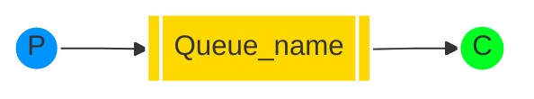

```mermaid
flowchart LR;
    C((C))

    style C fill:#00FF21, stroke:#FFFFFF,stroke-width:2px

    C
```

[`🏠 HOME`](../../README.md)  

[`📘 RabbitMQ THEORY`](./README.md) 

# Навчальний посібник з RabbitMQ - "Hello World!"

## Вступ

> [!NOTE]  
> **Попередні вимоги**  
>
> Цей навчальний посібник передбачає, що RabbitMQ встановлено і працює на локальному комп'ютері за стандартним портом (5672). У разі використання іншого хосту, порту або облікових даних, потрібно буде налаштувати параметри підключення.

RabbitMQ - це посередник повідомлень: він приймає та пересилає повідомлення. Ви можете уявити його як поштове відділення: коли ви кладете лист у поштову скриньку, ви можете бути впевнені, що поштар рано чи пізно доставить листа вашому одержувачеві. У цій аналогії RabbitMQ - це поштова скринька, поштове відділення та поштар.

Основна різниця між RabbitMQ та поштовим відділенням полягає в тому, що RabbitMQ не працює з паперовими документами, замість цього він приймає, зберігає та пересилає бінарні блоби даних - *повідомлення*.

RabbitMQ, так само як і взагалі відправка повідомлень, використовує певний жаргон.

• ***Продукування*** (Producing) означає не що інше, як відправлення. Програма, яка відправляє повідомлення, - це ***продюсер***.


• ***Черга*** - це назва для поштової скриньки в RabbitMQ. Хоча повідомлення проходять через RabbitMQ та ваші програми, вони можуть бути збережені лише всередині ***черги***. ***Черга*** обмежується лише обсягами пам'яті та диска хоста, і, по суті, це великий буфер для повідомлень.

Багато ***продюсерів*** можуть відправляти повідомлення, які йдуть в одну чергу, і багато ***споживачів*** можуть намагатися отримати дані з однієї черги.

Ось як ми представляємо чергу:


• ***Споживання*** має схоже значення з отриманням. ***Споживач*** - це програма, яка в основному очікує на отримання повідомлень.



Зверніть увагу, що виробник, споживач і посередник не обов'язково повинні знаходитися на одному хості; насправді, в більшості програм вони цього не роблять. А додаток може бути обома як продюсером так і споживачем.

# "Hello World"

У цій частині посібника ми напишемо дві програми на C#: продюсера, який відправляє одне повідомлення, і споживача, який отримує повідомлення і виводить їх. Ми обійдемо деякі деталі у .NET-клієнтському API, зосереджуючись на цій дуже простій речі, щоб приступити до роботи. Це "Hello World" у світі повідомлень.

На діаграмі нижче "P" - це наш продюсер, а "C" - наш споживач. Квадрат у середині - це черга - буфер повідомлень, який RabbitMQ зберігає від імені споживача.



> **The .NET client library**
>
> RabbitMQ підтримує кілька протоколів. У цьому навчальному посібнику використовується AMQP 0-9-1, який є відкритим, загального призначення протоколом для обміну повідомленнями. Існує кілька клієнтів для RabbitMQ на багатьох різних мовах програмування. Ми використовуватимемо .NET-клієнт, який надається RabbitMQ.
>
> Цей клієнт підтримує .NET Core, а також .NET Framework 4.5.1+. У цьому навчальному посібнику буде використано RabbitMQ .NET-клієнт версії 5.0 та .NET Core, тому переконайтеся, що ви його встановили і вказали в свій шлях.
> 
> Ви також можете використовувати .NET Framework для виконання цього навчального посібника, однак кроки налаштування будуть іншими.
>
> RabbitMQ .NET-клієнт версії 5.0 та пізніших версій розповсюджується через NuGet.
> 
> Цей навчальний посібник передбачає, що ви використовуєте PowerShell на Windows. На MacOS та Linux підходить практично будь-яка оболонка.

# Налаштування

Спочатку переконайтеся, що у вас є інструментальний набір .NET Core у вашому `PATH`.

```powershell
dotnet --help
```

Додайте команду, щоб вона вивела довідкове повідомлення.

Тепер згенеруйте два проекти: один для виробника та один для споживача.

```powershell
dotnet new console --name Send
mv Send/Program.cs Send/Send.cs
dotnet new console --name Receive
mv Receive/Program.cs Receive/Receive.cs
```

Це створить дві нові теки з назвами `Send` та `Receive`.

Потім ми додаємо залежність від клієнта.