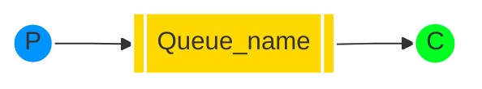

```mermaid
flowchart LR;
    C((C))

    style C fill:#00FF21, stroke:#FFFFFF,stroke-width:2px

    C
```

[`🏠 HOME`](../../README.md)  

[`📘 RabbitMQ THEORY`](./README.md) 

# Навчальний посібник з RabbitMQ - "Hello World!"

## Вступ

> [!NOTE]  
> **Попередні вимоги**  
>
> Цей навчальний посібник передбачає, що RabbitMQ встановлено і працює на локальному комп'ютері за стандартним портом (5672). У разі використання іншого хосту, порту або облікових даних, потрібно буде налаштувати параметри підключення.

RabbitMQ - це посередник повідомлень: він приймає та пересилає повідомлення. Ви можете уявити його як поштове відділення: коли ви кладете лист у поштову скриньку, ви можете бути впевнені, що поштар рано чи пізно доставить листа вашому одержувачеві. У цій аналогії RabbitMQ - це поштова скринька, поштове відділення та поштар.

Основна різниця між RabbitMQ та поштовим відділенням полягає в тому, що RabbitMQ не працює з паперовими документами, замість цього він приймає, зберігає та пересилає бінарні блоби даних - *повідомлення*.

RabbitMQ, так само як і взагалі відправка повідомлень, використовує певний жаргон.

• ***Продукування*** (Producing) означає не що інше, як відправлення. Програма, яка відправляє повідомлення, - це ***продюсер***.

• ***Черга*** - це назва для поштової скриньки в RabbitMQ. Хоча повідомлення проходять через RabbitMQ та ваші програми, вони можуть бути збережені лише всередині ***черги***. ***Черга*** обмежується лише обсягами пам'яті та диска хоста, і, по суті, це великий буфер для повідомлень.

Багато ***продюсерів*** можуть відправляти повідомлення, які йдуть в одну чергу, і багато ***споживачів*** можуть намагатися отримати дані з однієї черги.

Ось як ми представляємо чергу:

• ***Споживання*** має схоже значення з отриманням. ***Споживач*** - це програма, яка в основному очікує на отримання повідомлень.

