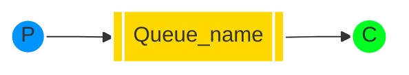

[`🏠 HOME`](../../README.md)  

[`📘 RabbitMQ THEORY`](./README.md) 

# Навчальний посібник з RabbitMQ - "Hello World!"

## Вступ

> [!NOTE]
> **Попередні вимоги**
> Цей навчальний посібник передбачає, що RabbitMQ встановлено і працює на локальному комп'ютері за стандартним портом (5672). У разі використання іншого хосту, порту або облікових даних, потрібно буде налаштувати параметри підключення.

