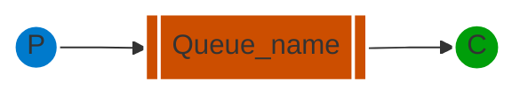
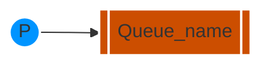
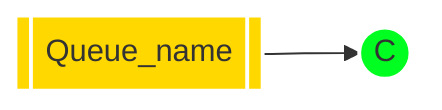
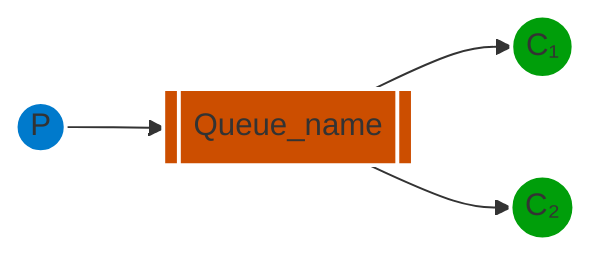

```mermaid
flowchart LR;
    C((C))

    style C fill:#00FF21, stroke:#FFFFFF,stroke-width:2px

    C
```

[`🏠 HOME`](../../README.md)  

[`📘 RabbitMQ THEORY`](./README.md) 

# Навчальний посібник з RabbitMQ - "Hello World!"

## Вступ

> [!NOTE]  
> **Попередні вимоги**  
>
> Цей навчальний посібник передбачає, що RabbitMQ встановлено і працює на `localhost` за стандартним портом (5672). У разі використання іншого хосту, порту або облікових даних, потрібно буде налаштувати параметри підключення.

RabbitMQ - це посередник повідомлень: він приймає та пересилає повідомлення. Ви можете уявити його як поштове відділення: коли ви кладете лист у поштову скриньку, ви можете бути впевнені, що поштар рано чи пізно доставить листа вашому одержувачеві. У цій аналогії RabbitMQ - це поштова скринька, поштове відділення та поштар.

Основна різниця між RabbitMQ та поштовим відділенням полягає в тому, що RabbitMQ не працює з паперовими документами, замість цього він приймає, зберігає та пересилає бінарні блоби даних - *повідомлення*.

RabbitMQ, так само як і взагалі відправка повідомлень, використовує певний жаргон.

• ***Продукування*** (Producing) означає не що інше, як відправлення. Програма, яка відправляє повідомлення, - це ***продюсер***.


• ***Черга*** - це назва для поштової скриньки в RabbitMQ. Хоча повідомлення проходять через RabbitMQ та ваші програми, вони можуть бути збережені лише всередині ***черги***. ***Черга*** обмежується лише обсягами пам'яті та диска хоста, і, по суті, це великий буфер для повідомлень.

Багато ***продюсерів*** можуть відправляти повідомлення, які йдуть в одну чергу, і багато ***споживачів*** можуть намагатися отримати дані з однієї черги.

Ось як ми представляємо чергу:


• ***Споживання*** має схоже значення з отриманням. ***Споживач*** - це програма, яка в основному очікує на отримання повідомлень.



Зверніть увагу, що виробник, споживач і посередник не обов'язково повинні знаходитися на одному хості; насправді, в більшості програм вони цього не роблять. А додаток може бути обома як продюсером так і споживачем.

## "Hello World"

У цій частині посібника ми напишемо дві програми на C#: продюсера, який відправляє одне повідомлення, і споживача, який отримує повідомлення і виводить їх. Ми обійдемо деякі деталі у .NET-клієнтському API, зосереджуючись на цій дуже простій речі, щоб приступити до роботи. Це "Hello World" у світі повідомлень.

На діаграмі нижче "P" - це наш продюсер, а "C" - наш споживач. Квадрат у середині - це черга - буфер повідомлень, який RabbitMQ зберігає від імені споживача.



> **The .NET client library**
>
> RabbitMQ підтримує кілька протоколів. У цьому навчальному посібнику використовується AMQP 0-9-1, який є відкритим, загального призначення протоколом для обміну повідомленнями. Існує кілька клієнтів для RabbitMQ на багатьох різних мовах програмування. Ми використовуватимемо .NET-клієнт, який надається RabbitMQ.
>
> Цей клієнт підтримує .NET Core, а також .NET Framework 4.5.1+. У цьому навчальному посібнику буде використано RabbitMQ .NET-клієнт версії 5.0 та .NET Core, тому переконайтеся, що ви його встановили і вказали в свій шлях.
> 
> Ви також можете використовувати .NET Framework для виконання цього навчального посібника, однак кроки налаштування будуть іншими.
>
> RabbitMQ .NET-клієнт версії 5.0 та пізніших версій розповсюджується через NuGet.
> 
> Цей навчальний посібник передбачає, що ви використовуєте PowerShell на Windows. На MacOS та Linux підходить практично будь-яка оболонка.

## Налаштування

Спочатку переконайтеся, що у вас є інструментальний набір .NET Core у вашому `PATH`.

```powershell
dotnet --help
```

Додайте команду, щоб вона вивела довідкове повідомлення.

Тепер згенеруйте два проекти: один для виробника та один для споживача.

```powershell
dotnet new console --name Send
mv Send/Program.cs Send/Send.cs
dotnet new console --name Receive
mv Receive/Program.cs Receive/Receive.cs
```

Це створить дві нові теки з назвами `Send` та `Receive`.

Потім ми додаємо залежність від клієнта.

```powershell
cd Send
dotnet add package RabbitMQ.Client
cd ../Receive
dotnet add package RabbitMQ.Client
```

Тепер, коли у нас налаштований проект .NET, ми можемо написати деякий код.

## Надсилання



Ми називаємо наш відправник повідомлень (виробник) `Send.cs`, а отримувач повідомлень (споживач) `Receive.cs`. Відправник буде підключатися до RabbitMQ, відправляти одне повідомлення, а потім завершувати роботу.

У файлі `Send.cs`(https://github.com/rabbitmq/rabbitmq-tutorials/blob/main/dotnet/Send/Send.cs) нам потрібно використовувати деякі простори імен:

```cs
using System.Text;
using RabbitMQ.Client;
```

Потім ми можемо створити з'єднання з сервером:

```cs
var factory = new ConnectionFactory { HostName = "localhost" };
using var connection = factory.CreateConnection();
using var channel = connection.CreateModel();
...
```

З'єднання абстрагує з'єднання сокетів та відповідає за переговори щодо версії протоколу, аутентифікацію тощо за нас. Тут ми підключаємось до вузла RabbitMQ на локальному комп'ютері - тобто localhost. Якщо ми хочемо підключитись до вузла на іншому комп'ютері, просто вкажемо його ім'я хоста або IP-адресу тут.

Далі ми створюємо канал, де знаходиться більшість API для виконання завдань.

Щоб відправити повідомлення, нам потрібно оголосити чергу, до якої ми хочемо відправити повідомлення; після цього ми можемо опублікувати повідомлення у чергу:

```cs
using System.Text;
using RabbitMQ.Client;

var factory = new ConnectionFactory { HostName = "localhost" };
using var connection = factory.CreateConnection();
using var channel = connection.CreateModel();

channel.QueueDeclare(queue: "hello",
                     durable: false,
                     exclusive: false,
                     autoDelete: false,
                     arguments: null);

const string message = "Hello World!";
var body = Encoding.UTF8.GetBytes(message);

channel.BasicPublish(exchange: string.Empty,
                     routingKey: "hello",
                     basicProperties: null,
                     body: body);
Console.WriteLine($" [x] Sent {message}");

Console.WriteLine(" Press [enter] to exit.");
Console.ReadLine();
```

Оголошення черги є ідемпотентним - воно буде створено лише у випадку, якщо вона ще не існує. Вміст повідомлення - це масив байтів, тому ви можете кодувати там все, що завгодно.

Коли код вище завершить своє виконання, канал і з'єднання будуть закриті. Це все стосується нашого відправника.

[Ось весь клас Send.cs](https://github.com/rabbitmq/rabbitmq-tutorials/blob/main/dotnet/Send/Send.cs)

> **Надсилання не працює!**
>
> Якщо це ваш перший раз використання RabbitMQ, і ви не бачите повідомлення "Sent", то ви, можливо, залишились з питанням, що може бути не так. Можливо, брокер був запущений без достатньої вільної місця на диску (за замовчуванням для цього потрібно щонайменше 50 МБ вільного місця) і, отже, відмовляється приймати повідомлення. Перевірте журнал брокера для підтвердження цього і, за необхідності, зменште ліміт. Документація з налаштування покаже вам, як встановити `disk_free_limit`.

## Отримання

Що ж до споживача, він слухає повідомлення від RabbitMQ. Таким чином, на відміну від продюсера, який публікує одне повідомлення, ми будемо тримати споживача постійно працюючим, щоб він слухав повідомлення і виводив їх.



Код (у файлі [Receive.cs](https://github.com/rabbitmq/rabbitmq-tutorials/blob/main/dotnet/Receive/Receive.cs)) має майже ті ж самі блоки коду `using`, що й у `Send`:
```cs
using System.Text;
using RabbitMQ.Client;
using RabbitMQ.Client.Events;
```

Налаштування аналогічне відправнику; ми відкриваємо з'єднання і канал, та оголошуємо чергу, з якої ми будемо споживати. Зауважте, що це відповідає черзі, на яку відправляє повідомлення `Send`.

```cs
var factory = new ConnectionFactory { HostName = "localhost" };
using var connection = factory.CreateConnection();
using var channel = connection.CreateModel();

channel.QueueDeclare(queue: "hello",
                     durable: false,
                     exclusive: false,
                     autoDelete: false,
                     arguments: null);
...
```

Зверніть увагу, що ми також оголошуємо чергу тут. Оскільки ми можемо запустити споживача перед відправником, ми хочемо переконатися, що черга існує, перш ніж ми спробуємо споживати повідомлення з неї.

Ми збираємося повідомити сервер, щоб він доставив нам повідомлення з черги. Оскільки він буде відправляти нам повідомлення асинхронно, ми надаємо зворотний виклик. Це те, що робить обробник подій `EventingBasicConsumer.Received`.

```cs
using System.Text;
using RabbitMQ.Client;
using RabbitMQ.Client.Events;

var factory = new ConnectionFactory { HostName = "localhost" };
using var connection = factory.CreateConnection();
using var channel = connection.CreateModel();

channel.QueueDeclare(queue: "hello",
                     durable: false,
                     exclusive: false,
                     autoDelete: false,
                     arguments: null);

Console.WriteLine(" [*] Waiting for messages.");

var consumer = new EventingBasicConsumer(channel);
consumer.Received += (model, ea) =>
{
    var body = ea.Body.ToArray();
    var message = Encoding.UTF8.GetString(body);
    Console.WriteLine($" [x] Received {message}");
};
channel.BasicConsume(queue: "hello",
                     autoAck: true,
                     consumer: consumer);

Console.WriteLine(" Press [enter] to exit.");
Console.ReadLine();
```

[Ось весь клас Receive.cs](https://github.com/rabbitmq/rabbitmq-tutorials/blob/main/dotnet/Receive/Receive.cs):

## Об'єднаймо все разом.
Відкрийте два термінальні вікна.

Ви можете запускати клієнти у будь-якому порядку, оскільки обидва оголошують чергу. Ми спочатку запустимо споживача, щоб ви могли побачити, як він очікує та отримує повідомлення.
```powershell
cd Receive
dotnet run
```

Далі запустіть продюсера.

```powershell
cd Send
dotnet run
```

Споживач роздрукує повідомлення, яке він отримає від виробника через RabbitMQ. Споживач буде продовжувати працювати, очікуючи повідомлень, тому спробуйте перезапустити виробника кілька разів.

Час перейти до другої частини і побудувати просту робочу чергу.

---

# Навчальний посібник з RabbitMQ - Робочі Черги
## Робочі Черги

> [!NOTE]  
> **Попередні вимоги**  
>
> Цей навчальний посібник передбачає, що RabbitMQ встановлено і працює на `localhost` за стандартним портом (5672). У разі використання іншого хосту, порту або облікових даних, потрібно буде налаштувати параметри підключення.

